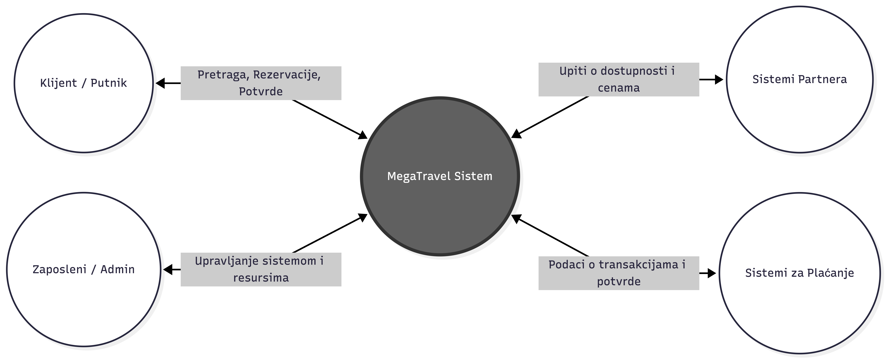

THREAT MODELING

**1\. MOTIVACIJA NAPADAČA**

**Sajber kriminalci \*\*\***

- **Motivacija:** Finansijska korist
- **Opis:** Pojedinci ili organizovane grupe koje žele profit.
- **Nivo veštine:** Srednji / visok
- **Pristup sistemu:** kompromitovani nalozi, eksterni pristup preko interneta putem web aplikacije, API servisa, phishing napada nad zaposlenim
- **Krajnji cilj:** Krađa podataka o platnim karticama, krađa naloga, prodaja ličnih podataka, lažna plaćanja, ransomware.

**Rivalske kompanije \*\*\***

- **Motivacija:** Indirektna finansija korist, prosperiranje svoje kompanije
- **Opis:** Kompanije u turizmu koje žele da steknu poslovnu prednost
- **Nivo veštine:** visok
- **Pristup sistemu:** kompromitovani zaposleni, phishing napad, iskorišćavanje ranjivosti javnih servisa
- **Krajnji cilj:** krađa korisnika I poslovnih strategija, cene nekih određenih ugovora, narušavanje reputacije

**Insajderi (zaposleni / bivši zaposleni) \*\*\***

- **Motivacija:** Osveta firmi, finansijska korist
- **Opis:** Mogu biti plaćenici od strane drugih kompanija, mogu raditi u svoju finansijsku korist ili imaju neku vrstu vendete prema kompaniji
- **Nivo veštine:** nizak/srednji/visok
- **Pristup sistemu:** legitiman interni pristup, imaju privilegije ulaska I rukovodstva internih poslovnih sistema
- **Krajnji cilj:** krađa ličnih podataka, krađa platnih detalja, prodaja internih informacija, sabotaža sistema

**Hacktivisti**

- **Motivacija:** Protest protiv kompanije
- **Opis:** Grupe sa političkim ciljevima
- **Nivo veštine:** srednji
- **Pristup sistemu:** eksterni pristup, iskorišćavanje ranjihovosti javnih servisa, DDoS napadi
- **Krajnji cilj:** rušenje sajta, curenje podataka

**Oportunisti \*\*\***

- **Motivacija:** Zabava uglavnom
- **Opis:** neiskusni uglavnom neplaćeni napadači
- **Nivo veštine:** nizak
- **Pristup sistemu:** korišćenje automatizovanih alata, pokušaji prijave na korisničke naloge (ili naloge zaspolenih)
- **Krajnji cilj:** testiranje ranjivosti, brute force login napadi

**Državno podržani napadači**

- **Motivacija:** Nadzor građana (mogu biti političari, poslovni ljudi, ali uglavnom uticajni), prikupljanje njima bitnih podataka
- **Opis:** Napredne grupe koje rade u korist neke države
- **Nivo veštine:** visok
- **Pristup sistemu:** napredan eksterni pristup, spear phishing napadi, zero-day ranjivosti, supply chain attack, kompromitovani zaposleni pa onda I interni pristup
- **Krajnji cilj:** prikupljanje podataka

**2\. IMOVINA**

**1\. Baza korisničkih naloga**

**• Izloženost (ko ima pristup):** korisnici aplikacije, administratori sistema, baze podataka, backend servisi

**• CIA ciljevi:** zaštita korisničkih podataka I lozinki, tačnost podataka naloga I mogućnost prijave korisnika u svakom trenutku

**• Uticaj kompromitacije:** krađa naloga, neovlašćen pristup, gubitak poverenja korisnika I samim tim reputaciona I finansijska šteta

**2\. Podaci o platnim karticama / transakcijama**

**• Izloženost (ko ima pristup):** korišćeni platni sistemi, određeni administratori, backend servisi za obradu plaćanja

**• CIA ciljevi:** zaštita podataka kartica I transakcija, tačnost iznosa I istorije tranzakcija, nesmetana obrada plaćanja

**• Uticaj kompromitacije:** finansijska krađa, zloupotreba kartica, prekid plaćanja, reputaciona I finansijska šteta

**3\. Rezervacije putovanja i istorija putovanja**

**• Izloženost (ko ima pristup):** korisnici, zaspoleni korisničke podrške, backend servisi, partneri kompanije poput hotela, avio kompanija itd.

**• CIA ciljevi:** zaštita podataka o putovanjima korisnika, tačnost rezervacija I statusa putovanja, mogućnost upravljanja rezervacijama u svakom trenutku

**• Uticaj kompromitacije:** neželjeno otkazivanje ili izmena rezervacije, curenje prihvatnih podataka, samim tim nezadovoljstvo korisnika, reputaciona I finansijska šteta

**4\. Lični podaci korisnika (PII)**

**• Izloženost (ko ima pristup):** korisnici svojih naloga, ovlašćeni zasposleni I administratori sistema, backend servisi, parterni kojima su podaci neophodni za uslugu koju pružaju

**• CIA ciljevi:** zaštita, ličnih podataka, tačnost korisničkih podataka, dostupnost za obradu I pružanje usluga

**• Uticaj kompromitacije:** krađa identiteta, zloupotreba ličnih podataka, zakonske kazne, gubitak poverenja, reputaciona I finansijska šteta

**5\. Admin nalozi i privilegovani pristupi**

**• Izloženost (ko ima pristup):** sistem administratori, bezbednosni tim, ovlašćeni zaposleni sa visokim privilegijama, DevOps tim

**• CIA ciljevi:** zaštita admin privilegija I pristupa, sprečavanje neovlašćenih izmena podataka, dostupnost admin naloga za hitne slučajeve

**• Uticaj kompromitacije:** potpuna kontrola nad sistemom, sve od prethodnog navedeno

**6\. Web aplikacija**

**• Izloženost (ko ima pristup):** Korisnici putem interneta, zaposleni, povezani backend servisi, administratori

**• CIA ciljevi:** zaštita korisničkih sesija, podataka I komunikacije, ispravno funkcionisanje aplikacije, neprekidan rad I pristup aplikacije

**• Uticaj kompromitacije:** nedostupnost sajta, krađa naloga, neovlašćene izmene prikazanih podataka, finansijska I reputaciona šteta

**7\. API servisi**

**• Izloženost (ko ima pristup):** Web aplikacija, mobilna aplikacija (ukoliko postoji), interni sistemi kompanije I ovlašćeni sistemi putem interneta (hotelski sistemi, payment sistemi itd.)

**• CIA ciljevi:** zaštita podataka koji se razmenjuju putem API poziva, tačnost zahteva, odgovora I transkacija, neprekidan rad servisa

**• Uticaj kompromitacije:** neovlašćen pristup podacima, prekid rada, lažni zahtevi, finansijska I reputaciona šteta

**8\. Baza partnera (hoteli, avio kompanije, rent-a-car)**

**• Izloženost (ko ima pristup):** ovlašćeni zaposleni, administratori sistema, interni servisi kompanije i partnerski sistemi

**• CIA ciljevi:** zaštita podataka o partnerima, ugovorima, cenama, tačnost ovih podataka I njihova stalna dostupnost radi rezervacija I poslovne saradnje

**• Uticaj kompromitacije:** curenje poverljivih poslovnih informacija, prekid saradnje sa partnerima, pogrešne rezervacije I zahtevi, finansijska I reputaciona šteta

**9\. Interna dokumentacija i poslovne strategije**

**• Izloženost (ko ima pristup):** menadžment, ovlašćeni zaposleni, administratori sistema i interni poslovni sistemi kompanije

**• CIA ciljevi:** zaštita poslovnih planova, procedura I finansijskih informacija, tačnost I neizmenjenost internih dokumenata I njihova dostupnost

**• Uticaj kompromitacije:** gubitak neke ostvarene poslovne prednosti, curenje poverljivih informacija, reputaciona I finansijska šteta

**10\. Serveri / cloud infrastruktura**

**• Izloženost (ko ima pristup):** administratori sistema, tehničko osoblje, ovlašćeni interni servisi, cloud provider

**• CIA ciljevi:** zaštita konfiguracije sistema, podataka I ključeva, ispravno funkcionisanje servera, mreže I podešavanja I njihov neprekidan rad

**• Uticaj kompromitacije:** pad sistema, gubitak podataka, finansijska I reputaciona šteta  
 

**3\. POVRŠINA NAPADA**

Korisnici koji komuniciraju sa sistemom jesu:

- Klijenti (putnici) : veliki broj putnika (merljiv u milionima) pristupa MegaTravel platformi radi istraživanja i rezervacije usluga
- Zaposleni : Mnoštvo zaposlenih lica koje koriste aplikacije u više slojeva : npr admin, prodavac…
- Sistemi za smeštaj(partneri) : Eksterni sistemi hotela pomoću koje dobijamo informacije o dostupnosti i mestima u hotelima.
- Sistemi za prevoz(avio-kompanije) : Eksterni sistemi pomoću kojih pristupamo ponudama različitih avio kompanija koje su dostupne krajnjim korisnicima.
- Sistemi za obradu plaćanja (payment system) : Eksterni procesori za realizaciju transakcija (najčešće banke).

Mapiranje ulaznih tačaka napada na površinu:

- Javni digitalni kanali, kao što su veb/mobilna aplikacija koje predstavlja glavnu tačku interfejsa klijenta.
- Korporativni sistemi - u to spadaju administritavni paneli koje koriste zaposleni za rukovanje nalozima i resursima, email serveri koje služe za komunikaciju sa klijentima. Ovde se pojavljuje pojam „phishing" kao učestao i uspešan način za distribuciju zlonamernog softvera ili drugih pokušaja krađe putem lažnog mejla. (npr poruke koje stižu sa nepoznatih brojeva sa zahtevima poznatim ljudima)
- Autentifikacioni sistemi, što predstavlja login za korisnike I zaposlene, gde može biti kritična tačka zbog slabih lozniki, neadekvatne autentifikacije ili slično.
- Payment integracija - gde imamo rizik zbog slanja ličnih podataka klijenta. Predstavlja ulaznu tačku gde se može destiti krađa kartičnih podataka, manipulacija transakcijama I tako se kompormitovati ovaj ceo eksterni sistem.
- API integracije sa partnerima - Malopre pomenuti, takođe eksterni sistem, može predstavljati tačku ulaza. Rizici jesu nevalidirani ulazni podaci, zlonamerni partner ili kompromitovan API za komunikaciju.

**4\. DATA FLOW DIAGRAMS**

####1\. Kontekstni dijagram
 

Na ovom dijagramu posmatramo samo MegaTravel kao svojstven sistem (backend, fontend, baze, infrastruktura). Posmatramo eksterne komunikacije I ko sve ima dodira sa našim sistemom, što nam ukazuje na potencijalne pretnje. Imamo četiri glavna podsistema - putnici, zaposleni, sistemi partnera (kao što su avio komapnije ili sistemi hotela za rezervacije) I sistemi za plaćanje (API banaka). Ovde možemo u širem kontekstu uočiti koje komunikacije se ostvaruju u našem sistemu I sa kojih pozicija se pretnja može pojaviti.

####2\. Dijagram toka podataka (ceo)

Na slici se nalazi data flow diagram u kome su uivičene granica poverenja, korporativna zona i kritična zona podataka. U suštini bi sva od ova tri mogla biti neke trust boundaries. Na jednoj strani imamo baze podataka i cloud infrastukturu, zatim web aplikaciju i autentifikacioni sistem. I kao treću celinu imamo korporativnu zonu koja obuhvata administratorske panele, poslovnu logiku, kao i API servise za komuniciranje za sistemima za plaćanje i partnerskim API-jima.

## 5. ANALIZA PRETNJI I MITIGACIJA

STRIDE metodologija pokriva šest kategorija pretnji: **S**poofing (lažno predstavljanje), **T**ampering (neovlašćena izmena podataka), **R**epudiation (poricanje akcija), **I**nformation Disclosure (otkrivanje informacija), **D**enial of Service (uskraćivanje usluge), **E**levation of Privilege (eskalacija privilegija).

Analiza je organizovana po komponentama DFD dijagrama, prolazeći kroz sve tri zone poverenja.

---

### 5.1 Web / Mobilna Aplikacija (DMZ)

#### PRETNJA 1: Spoofing: Lažno predstavljanje korisnika

- **Opis:** Napadač preuzima sesiju legitimnog korisnika putem krađe session tokena (session hijacking) ili cookie-ja, ili se prijavljuje sa ukradenim kredencijalima pribavljenim phishingom.
- **Pogođena imovina:** Baza korisničkih naloga, rezervacije, PII
- **Napadači:** Sajber kriminalci, oportunisti
- **Ranjivosti:** Slabe lozinke, odsustvo MFA, sesijski tokeni koji se ne invaliduju nakon odjave, prenos podataka bez HTTPS
- **Mitigacije:**
  - Uvesti obaveznu višefaktorsku autentifikaciju (MFA) za sve korisnike
  - Koristiti HTTPS/TLS za sav saobraćaj
  - Implementirati kratkotrajna sesijska vremena isteka i invalidaciju tokena nakon odjave
  - Primeniti rate limiting na login endpoint-u radi sprečavanja brute force napada
  - Koristiti HttpOnly i Secure zastavice na kolačićima sesije

---

#### PRETNJA 2: Tampering: Manipulacija rezervacijama

- **Opis:** Napadač menja parametre HTTP zahteva (npr. ID rezervacije, iznos plaćanja, datum) kako bi izmenio tuđu rezervaciju ili snizio cenu usluge.
- **Pogođena imovina:** Baza rezervacija / PII, sistemi partnera
- **Napadači:** Sajber kriminalci, oportunisti
- **Ranjivosti:** Nedostatak autorizacione provere na strani servera (Insecure Direct Object Reference - IDOR), nepotpuna validacija ulaznih podataka
- **Mitigacije:**
  - Primeniti striktnu autorizaciju na serveru - korisnik sme pristupati isključivo sopstvenim resursima
  - Validirati sve ulazne podatke na serverskoj strani (ne oslanjati se na klijentsku validaciju)
  - Koristiti indirektne reference umesto direktnih ID-ova u URL-ovima

---

#### PRETNJA 3: Information Disclosure: XSS napad

- **Opis:** Napadač ubacuje zlonamerni JavaScript kod u polja web aplikacije. Ovaj kod se izvršava u browseru žrtve i može ukrasti sesijski token, PII podatke ili izvršiti akcije u ime korisnika.
- **Pogođena imovina:** Web aplikacija, korisnički nalozi, PII
- **Napadači:** Sajber kriminalci, oportunisti
- **Ranjivosti:** Nedovoljna sanitizacija korisničkog unosa, odsustvo Content Security Policy (CSP)
- **Mitigacije:**
  - Implementirati Content Security Policy (CSP) headere
  - Koristiti output encoding za sve korisničke unose koji se prikazuju u HTML-u
  - Primeniti biblioteke za sanitizaciju unosa
  - Koristiti HttpOnly cookie-je kako JavaScript ne bi mogao čitati sesijske tokene

---

#### PRETNJA 4: Denial of Service: Preopterećenje web aplikacije

- **Opis:** Napadač šalje ogromnu količinu zahteva ka web aplikaciji (DDoS) kako bi je učinio nedostupnom za legitimne korisnike.
- **Pogođena imovina:** Web aplikacija, dostupnost sistema
- **Napadači:** Hacktivisti, rivalske kompanije
- **Ranjivosti:** Nedostatak zaštite od volumetrijskih napada, odsustvo CDN i WAF
- **Mitigacije:**
  - Koristiti CDN (Content Delivery Network) sa DDoS zaštitom
  - Implementirati Web Application Firewall (WAF)
  - Primeniti rate limiting i throttling po IP adresi
  - Koristiti auto-scaling cloud infrastrukturu za apsorbovanje naglih skokova saobraćaja

---

### 5.2 Autentifikacioni Sistem (DMZ → Kritična Zona)

#### PRETNJA 5: Spoofing: Brute force i credential stuffing napad

- **Opis:** Napadač automatizovanim alatom pokušava prijaviti se isprobavanjem velikog broja lozinki ili parova korisničko ime/lozinka preuzetih iz prethodno procurelih baza podataka sa drugih servisa.
- **Pogođena imovina:** Baza korisnika, korisnički nalozi
- **Napadači:** Oportunisti, sajber kriminalci
- **Ranjivosti:** Odsustvo account lockout mehanizma, nedostatak detekcije anomalija pri prijavi, korisnici koji recikliraju lozinke
- **Mitigacije:**
  - Implementirati account lockout ili CAPTCHA nakon određenog broja neuspelih pokušaja
  - Uvesti detekciju sumnjivih prijava (neobična geografska lokacija, neobično vreme)
  - Primeniti obavezni MFA
  - Integrisati proveru da li su korisničke lozinke procurele (npr. HaveIBeenPwned API)

---

#### PRETNJA 6: Repudiation: Poricanje izvršenih akcija

- **Opis:** Korisnik ili zaposleni tvrdi da nije izvršio određenu akciju (npr. kreiranje rezervacije, izmenu podataka, odobravanje transakcije) jer ne postoje pouzdani zapisi koji dokazuju suprotno.
- **Pogođena imovina:** Baza rezervacija, interni poslovni sistemi
- **Napadači:** Insajderi, sajber kriminalci
- **Ranjivosti:** Nepostojanje sveobuhvatnog audit loga, logovi koji se mogu naknadno izmeniti ili obrisati
- **Mitigacije:**
  - Implementirati nepromenjive (append-only) audit logove za sve kritične akcije korisnika i administratora
  - Logove čuvati u odvojenoj, zaštićenoj infrastrukturi sa ograničenim pristupom
  - Primeniti digitalne potpise na kritičnim transakcijama
  - Redovno pregledati logove putem SIEM alata

---

### 5.3 API Servisi (Interna Korporativna Zona)

#### PRETNJA 7: Spoofing: Lažno predstavljanje eksternih sistema (partner API / payment API)

- **Opis:** Napadač kompromituje ili lažira partnerski API sistem (hotel, avio kompanija) ili sistem za plaćanje, te šalje lažne odgovore MegaTravel sistemu - npr. potvrdu rezervacije koja ne postoji, ili lažnu potvrdu plaćanja.
- **Pogođena imovina:** API servisi, baza partnera, finansijske transakcije
- **Napadači:** Rivalske kompanije, sajber kriminalci
- **Ranjivosti:** Odsustvo verifikacije identiteta eksternih sistema, nekriptovana API komunikacija, odsustvo validacije odgovora
- **Mitigacije:**
  - Koristiti međusobnu TLS autentifikaciju (mTLS) za komunikaciju sa eksternim sistemima
  - Validirati sve odgovore partnerskih API-ja pre obrade
  - Koristiti API ključeve i OAuth 2.0 za autorizaciju eksternih poziva
  - Implementirati whitelist dozvoljenih IP adresa za partnerske sisteme

---

#### PRETNJA 8: Tampering (SQL Injection nad bazama podataka)

- **Opis:** Napadač kroz API endpoint ubacuje zlonamerni SQL kod u ulazne parametre, čime može čitati, menjati ili brisati podatke iz baza (korisnici, rezervacije, partneri).
- **Pogođena imovina:** Baza korisnika, baza rezervacija / PII, baza partnera
- **Napadači:** Sajber kriminalci, oportunisti
- **Ranjivosti:** Dinamičko konstruisanje SQL upita bez parametrizacije, nedovoljna validacija ulaza
- **Mitigacije:**
  - Koristiti isključivo parametrizovane upite (prepared statements) i ORM framework-e
  - Primeniti princip najmanjih privilegija za database naloge - aplikacija ne sme koristiti admin DB nalog
  - Implementirati WAF sa pravilima za detekciju SQL injection pokušaja
  - Redovno vršiti penetraciono testiranje

---

#### PRETNJA 9: Information Disclosure: Izloženost osetljivih podataka kroz API

- **Opis:** API vraća više podataka nego što je potrebno (over-fetching), npr. u odgovoru se nalaze hash lozinki, interni ID-ovi, PII podataka trećih lica ili poslovne informacije koje klijent ne bi trebalo da vidi.
- **Pogođena imovina:** PII, baza korisnika, interni poslovni podaci
- **Napadači:** Sajber kriminalci, rivalske kompanije
- **Ranjivosti:** Nedostatak filtriranja API odgovora, slaba implementacija autorizacije na nivou polja podataka
- **Mitigacije:**
  - Primeniti princip minimalne izloženosti podataka - API vraća samo ona polja koja su neophodna za konkretni zahtev
  - Koristiti Data Transfer Object (DTO) sloj koji eksplicitno definiše šta se vraća klijentu
  - Implementirati autorizaciju na nivou polja (field-level authorization)
  - Maskirati ili ukloniti osetljive podatke iz logova i debug poruka

---

#### PRETNJA 10: Elevation of Privilege: Neovlašćen pristup admin funkcionalnostima

- **Opis:** Napadač koji ima korisnički nalog (ili kompromitovani nalog zaposlenog nižeg ranga) iskorišćava ranjivost u autorizacionoj logici kako bi pristupio admin panelima ili izvršio privilegovane operacije.
- **Pogođena imovina:** Admin nalozi, poslovna logika / backend, sve baze podataka
- **Napadači:** Insajderi, sajber kriminalci
- **Ranjivosti:** Nedostatak Role-Based Access Control (RBAC), autorizacione provere koje se vrše samo na frontend-u, horizontalna ili vertikalna eskalacija privilegija
- **Mitigacije:**
  - Implementirati RBAC (Role-Based Access Control) sa jasno definisanim rolama i permisijama
  - Sve autorizacione provere vršiti isključivo na serverskoj strani
  - Primeniti princip najmanjih privilegija za sve naloge zaposlenih
  - Redovno sprovoditi pregled i reviziju dodeljenih privilegija (access review)
  - Admin panele učiniti dostupnim isključivo iz interne mreže ili putem VPN-a

---

### 5.4 Kritična Zona Podataka

#### PRETNJA 11: Information Disclosure: Kompromitacija baze korisnika i PII

- **Opis:** Napadač dobija neovlašćen pristup bazi podataka koja sadrži korisničke naloge, lozinke i lične podatke (PII) - direktno kroz SQL injection, kompromitovanu infrastrukturu ili insajdersku pretnju.
- **Pogođena imovina:** Baza korisnika, baza rezervacija / PII
- **Napadači:** Sajber kriminalci, insajderi, državno podržani napadači
- **Ranjivosti:** Nekriptovano skladištenje lozinki i PII, previše širok pristup bazi, nepostojanje enkripcije u mirovanju (encryption at rest)
- **Mitigacije:**
  - Lozinke čuvati isključivo u hashovanom obliku uz upotrebu jakih algoritama (bcrypt, Argon2)
  - Primeniti enkripciju u mirovanju (AES-256) za sve osetljive podatke u bazama
  - Ograničiti pristup bazama na minimum potrebnih servisa i naloga
  - Implementirati monitoring neobičnih pristupa bazi (anomaly detection)
  - Uskladiti se sa GDPR regulativom u pogledu pseudonimizacije i minimizacije podataka

---

#### PRETNJA 12: Tampering: Neovlašćena izmena konfiguracije cloud infrastrukture

- **Opis:** Napadač koji dobije pristup cloud upravljačkoj konzoli (npr. kroz kompromitovane cloud kredencijale ili API ključeve) menja konfiguraciju infrastrukture - otvara portove, menja firewall pravila, kreira backdoor naloge ili eksfiltrira ključeve.
- **Pogođena imovina:** Cloud infrastruktura, konfiguracije i ključevi
- **Napadači:** Insajderi, sajber kriminalci, državno podržani napadači
- **Ranjivosti:** API ključevi u izvornom kodu ili environment fajlovima, previše dozvola za cloud naloge, odsustvo MFA za cloud pristup
- **Mitigacije:**
  - Nikada ne čuvati cloud API ključeve u izvornom kodu - koristiti secrets management alate (npr. HashiCorp Vault, AWS Secrets Manager)
  - Primeniti MFA za sve cloud konzolne pristupe
  - Koristiti Infrastructure as Code (IaC) sa verzionisanjem i review procesom za izmene infrastrukture
  - Implementirati Cloud Security Posture Management (CSPM) alate za kontinuirani monitoring konfiguracije
  - Primeniti princip najmanjih privilegija za sve cloud IAM naloge

---

#### PRETNJA 13: Denial of Service: Ransomware napad na baze i infrastrukturu

- **Opis:** Napadač (najčešće sajber kriminalac) instalira ransomware koji enkriptuje baze podataka i servere, čineći ceo sistem nedostupnim dok se ne plati otkup.
- **Pogođena imovina:** Sve baze podataka, cloud infrastruktura, web aplikacija
- **Napadači:** Sajber kriminalci
- **Ranjivosti:** Odsustvo segmentacije mreže, nedovoljno učestali backup-ovi, neažuriran softver sa poznatim ranjivostima
- **Mitigacije:**
  - Redovno praviti backup podataka i testirati postupak oporavka (3-2-1 backup strategija)
  - Segmentirati mrežu kako kompromitacija jednog segmenta ne bi automatski zahvatila ceo sistem
  - Redovno ažurirati softver i primenjivati security patch-eve
  - Implementirati Endpoint Detection and Response (EDR) rešenja na svim serverima
  - Razviti i redovno testirati plan oporavka od katastrofe (Disaster Recovery Plan)

---

### 5.5 Granica Poverenja: Klijent -> DMZ

#### PRETNJA 14: Spoofing / Information Disclosure: Man-in-the-Middle napad

- **Opis:** Napadač koji se nalazi između klijenta i MegaTravel sistema presreće komunikaciju, čita osetljive podatke u tranzitu (kredencijale, platne podatke) ili ih modifikuje pre isporuke.
- **Pogođena imovina:** Podaci o platnim karticama, korisnički nalozi, PII
- **Napadači:** Sajber kriminalci
- **Ranjivosti:** Nedostatak TLS enkripcije ili korišćenje zastarelih protokola (SSL, TLS 1.0/1.1), nevalidovani SSL sertifikati
- **Mitigacije:**
  - Primeniti HTTPS sa TLS 1.2+ na svim komunikacionim kanalima
  - Implementirati HTTP Strict Transport Security (HSTS)
  - Koristiti Certificate Pinning za mobilnu aplikaciju
  - Redovno obnavljati i pratiti valjanost SSL/TLS sertifikata

---

### 5.6 Interna Korporativna Zona: Zaposleni / Admin

#### PRETNJA 15: Spoofing: Phishing napad na zaposlene

- **Opis:** Napadač šalje lažne emailove zaposlenima (spear phishing) lažno se predstavljajući kao IT odeljenje, menadžment ili partner kompanija. Cilj je krađa kredencijala ili instalacija malvera koji otvara interni pristup sistemu.
- **Pogođena imovina:** Admin nalozi, interna korporativna zona, sve baze podataka
- **Napadači:** Rivalske kompanije, insajderi, državno podržani napadači
- **Ranjivosti:** Nedovoljno bezbednosno obrazovanje zaposlenih, odsustvo email filtriranja, nepostojanje MFA
- **Mitigacije:**
  - Sprovoditi redovne obuke o bezbednosti i simulacije phishing napada
  - Implementirati napredne email filtere (anti-phishing, anti-spoofing, DMARC/DKIM/SPF)
  - Primeniti MFA za sve interne naloge
  - Koristiti Zero Trust pristup - ne verovati automatski ni internom saobraćaju