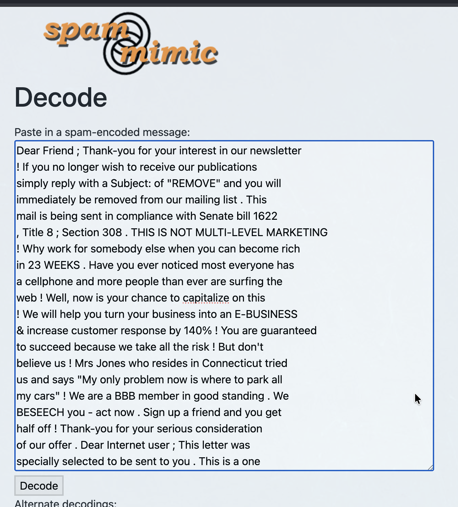
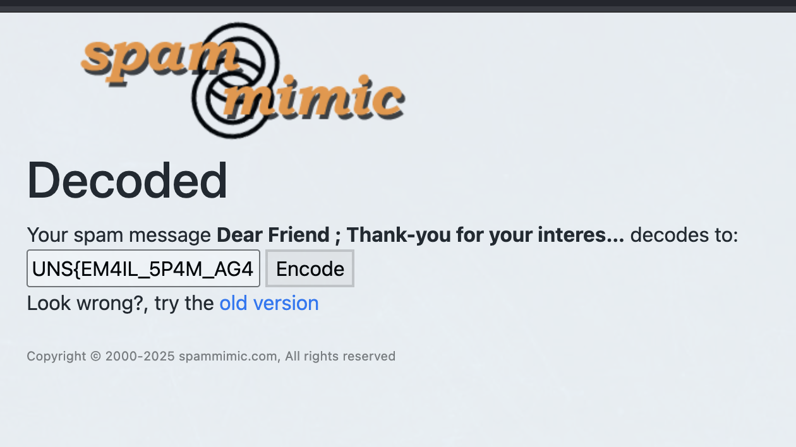

# Nigerian Prince

## Challenge

- **email.txt** reading:
    ```txt
    Dear Friend ; Thank-you for your interest in our newsletter 
    ! If you no longer wish to receive our publications 
    simply reply with a Subject: of "REMOVE" and you will 
    immediately be removed from our mailing list . This 
    mail is being sent in compliance with Senate bill 1622 
    , Title 8 ; Section 308 . THIS IS NOT MULTI-LEVEL MARKETING 
    ! Why work for somebody else when you can become rich 
    in 23 WEEKS . Have you ever noticed most everyone has 
    a cellphone and more people than ever are surfing the 
    web ! Well, now is your chance to capitalize on this 
    ! We will help you turn your business into an E-BUSINESS 
    & increase customer response by 140% ! You are guaranteed 
    to succeed because we take all the risk ! But don't 
    believe us ! Mrs Jones who resides in Connecticut tried 
    us and says "My only problem now is where to park all 
    my cars" ! We are a BBB member in good standing . We 
    BESEECH you - act now . Sign up a friend and you get 
    half off ! Thank-you for your serious consideration 
    of our offer . Dear Internet user ; This letter was 
    specially selected to be sent to you . This is a one 
    time mailing there is no need to request removal if 
    you won't want any more . This mail is being sent in 
    compliance with Senate bill 1916 , Title 1 ; Section 
    305 ! THIS IS NOT A GET RICH SCHEME ! Why work for 
    somebody else when you can become rich in 81 days ! 
    Have you ever noticed people love convenience and how 
    long the line-ups are at bank machines . Well, now 
    is your chance to capitalize on this ! WE will help 
    YOU turn your business into an E-BUSINESS plus turn 
    your business into an E-BUSINESS . You can begin at 
    absolutely no cost to you . But don't believe us ! 
    Prof Jones of Indiana tried us and says "I was skeptical 
    but it worked for me" ! This offer is 100% legal ! 
    Because the Internet operates on "Internet time" you 
    must hurry ! Sign up a friend and you'll get a discount 
    of 50% . Thank-you for your serious consideration of 
    our offer . 
    ```
- task.txt reading:
    ```txt
    4. Nigerian Prince
	- Flag format : UNS{}
	- Your friend received a very strange email. Since he knows you understand computers, he sent you the email's content and asked you to check if that email has any meaning or it's just another spam?

    ```

## Solving

Email does look really weird. It is like someone just threw around random words talking about some prosperity nonsense. At first i thought the flag could hide in words with all upper letters. My mind led me thinking that following first letter of all words of that kind, i would capture the flag. Did not work. Next thing was those random pages thrown into text like `Senate bill 1622 , Title 8 ; Section 308` got me thinking i could find flag through searching through these articles, but it led me to nothing.

Not much after i tried do decode this spam mail, first with revealing all white text. I actually learnt that hiding messages inside emails through spam words. I found site called spammimic.com and it actually decodes it so i got flag.



Clicking decode, we get this:



We get our flag, reading ***UNS{EM4IL_5P4M_AG4N?}***.