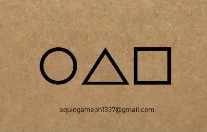
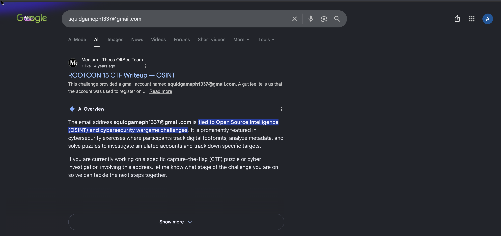
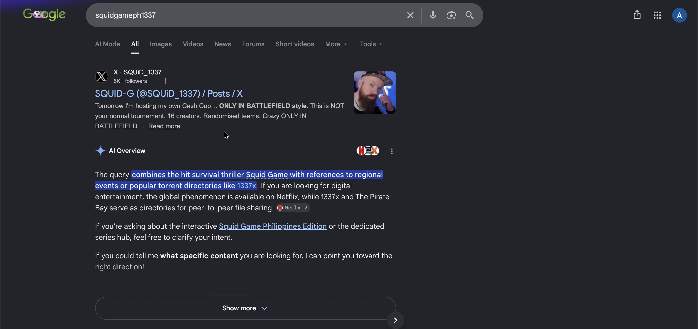
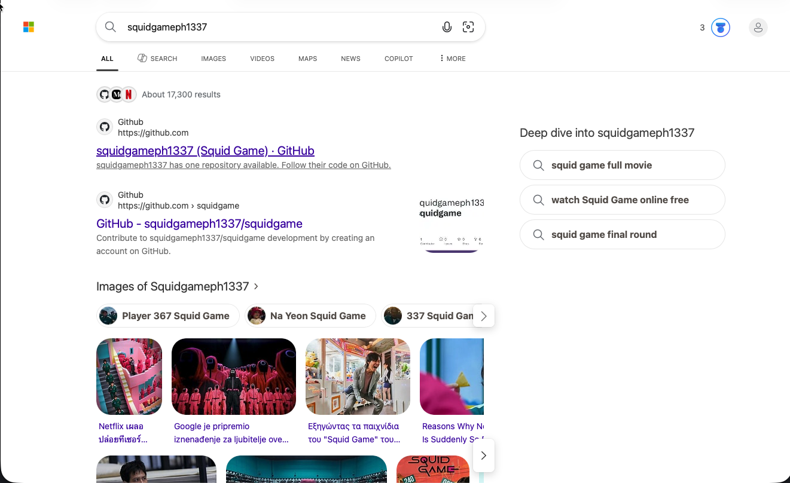
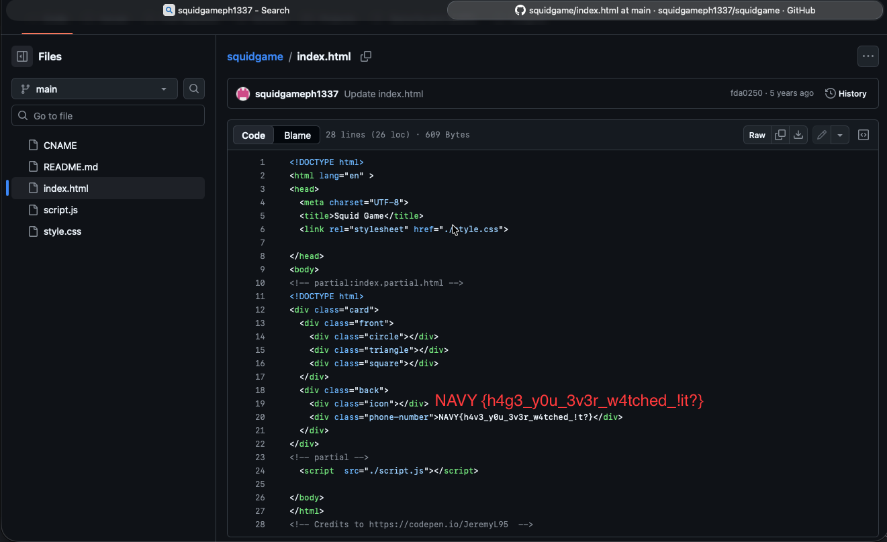

# SquidGame


## Challenge


    ```txt
    8. Squid Game Invitation
        - Flag format : NAVY{}
    ```

    Assume that we look for a flag that is wrapped in `NAVY{}`.
- And an image:

    

    Classical Squidgame characters as seen in the TV series.


## Solving

The picture seems normal, besides it has gmail on it. I had to check stenography analysis on Aperi Solve. Stenography analysis is proccess of detecting hidden data like messages,files or payload within ordinary data like images, audio or video. 


Did not help tho. My mind was then redirected to searching on Google. Even sent an email to one on the picture. It was not answered indeed. 





Did not find anything interesting. Maybe switching browser engine would help.



Found some github repo.



Inside repo squidgame, i entered all files, and in index.html i captured flag `NAVY{h4v3_y0u_3v3r_w4tched_!t?}`. That would be the solve of this task.

