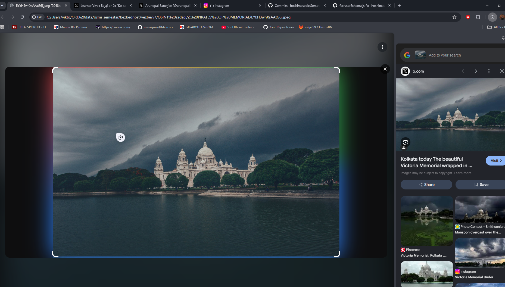
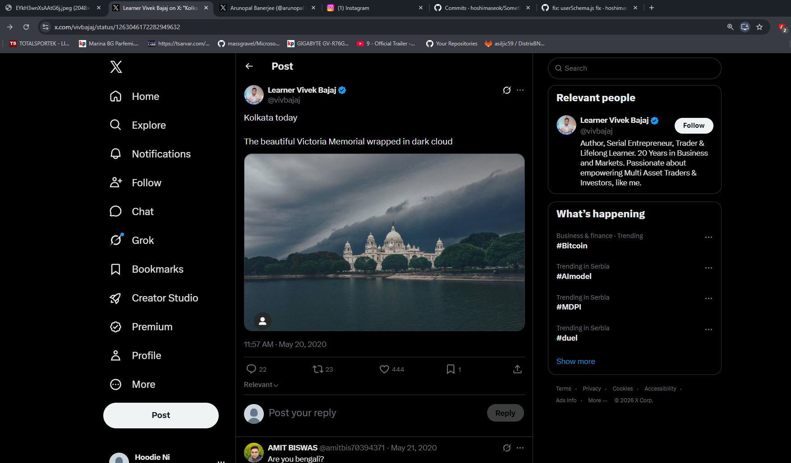
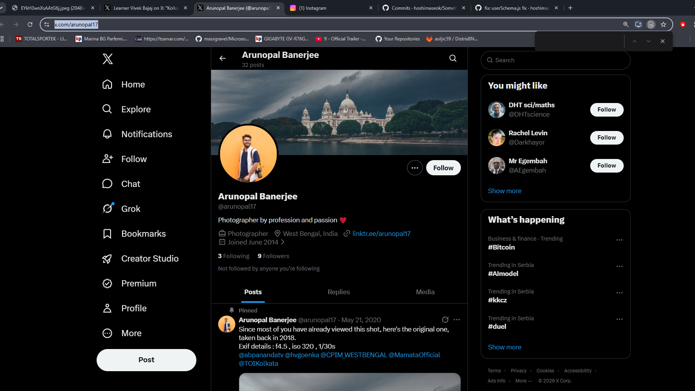
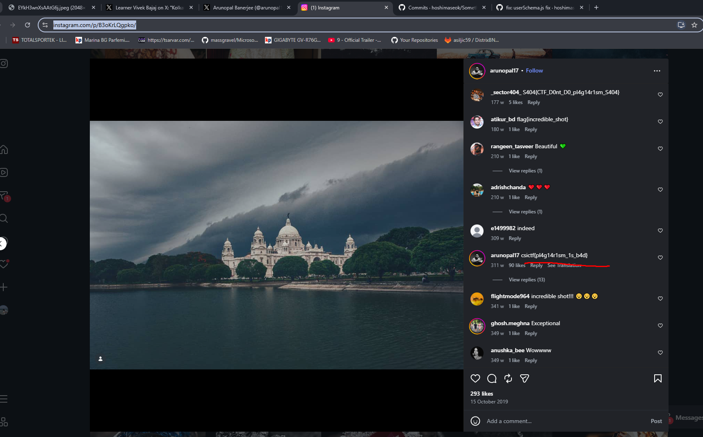
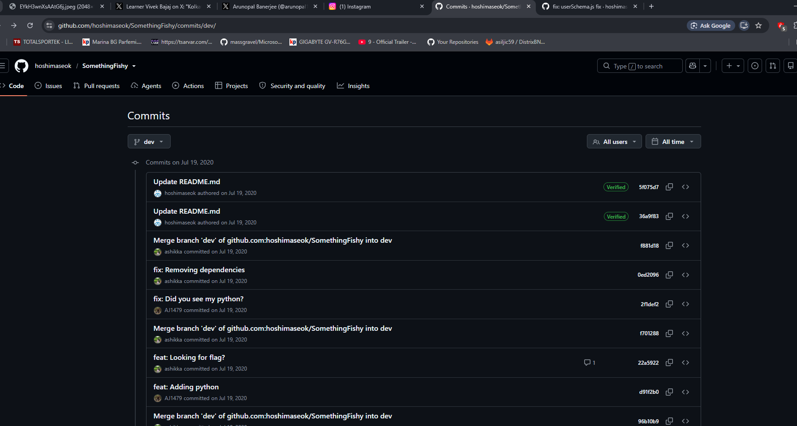
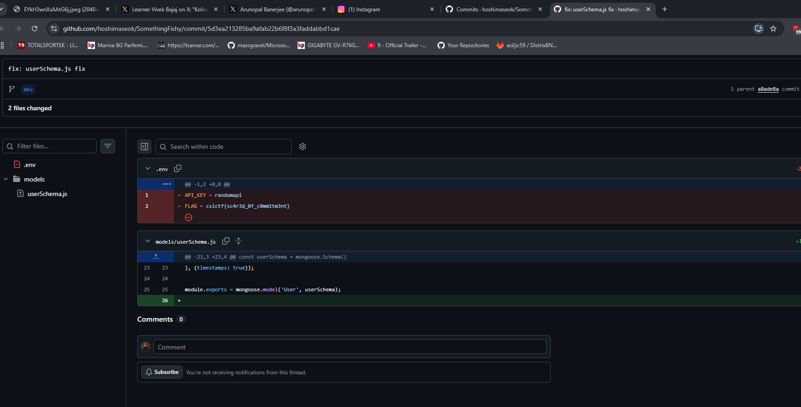
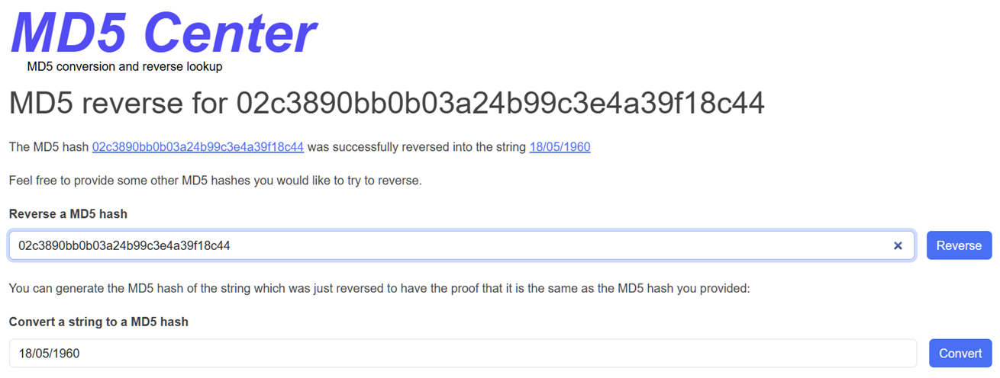
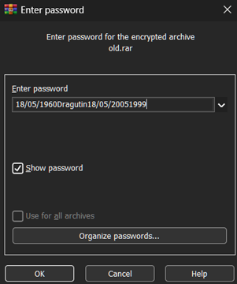
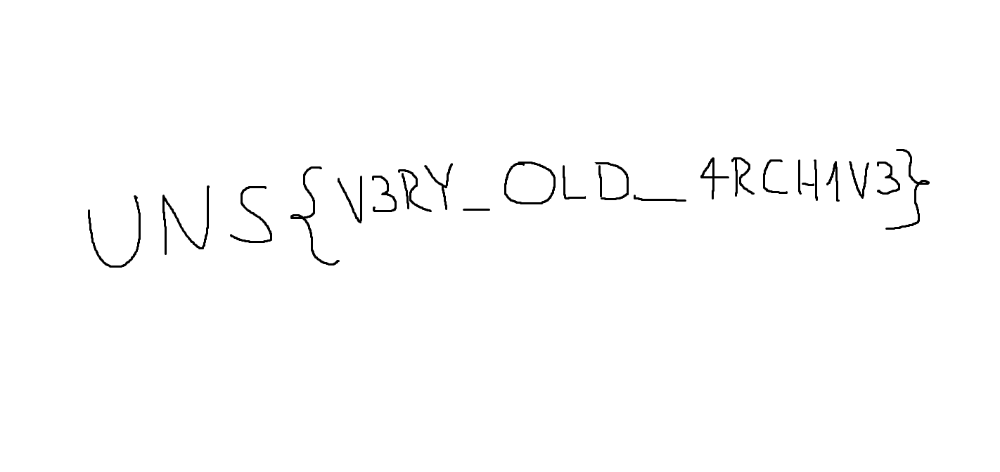
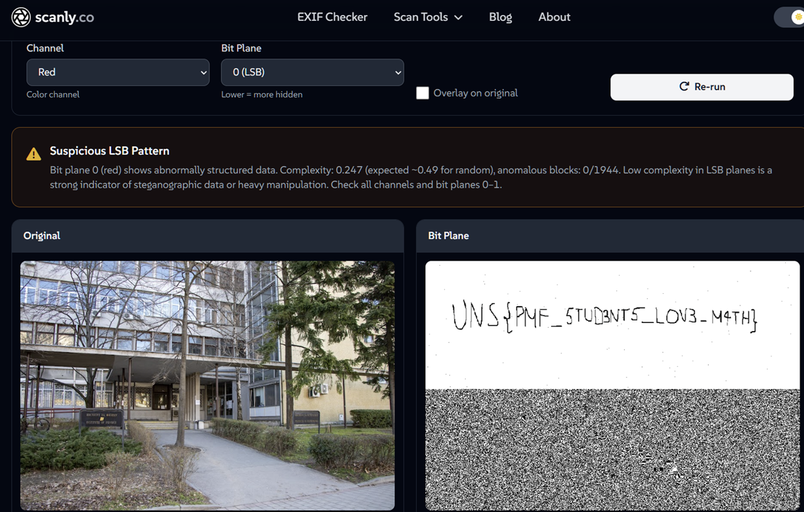

# OSINT zadaci write up

## 2. PIRATES OF MEMORIAL

**Zadatak:** Pronađi flag u komentaru originalnog fotografa.

**Odgovor:** `csictf{pl4g14r1sm_1s_b4d}`

Sliku sam pretražio pomoću Google Lensa. U rezultatima sam našao [tweet](https://x.com/vivbajaj/status/1263046172282949632) gde je objavljena ista fotografija Victoria Memoriala u Kalkuti. U komentarima se pominje pravi autor, [Arunopal Banerjee](https://x.com/arunopal17).

Na X profilu u komentarima nisam našao flag, pa sam prešao na njegov Instagram. Na [originalnom postu](https://www.instagram.com/p/B3oKrLQgpko/) flag se nalazi u komentarima.

## 3. COMMITMENT

**Zadatak:** Prati korisnika `hoshimaseok` i pronađi flag.

**Odgovor:** `csictf{sc4r3d_0f_c0mm1tm3nt}`

Username sam ukucao u Google i došao do [GitHub profila](https://github.com/hoshimaseok). Pregledao sam repozitorijume i repozitorijum SomethingFishy mi je delovao sumnjivo, pogotovo jer naziv zadatka Commitment ukazuje na git commit istoriju.

Prvo sam pretražio fajlove u repou upisujući `csictf` u GitHub Code search, ali nisam našao ništa. Shvatio sam da flag nije u trenutnom stanju koda, već u istoriji commitova. Otišao sam na Commits, prebacio se na granu `dev` jer ima mnogo više commitova od `master` grane, i počeo da pregledam commitove jedan po jedan. Za svaki commit sam otvarao Files changed i gledao da li ima obrisanih fajlova, koji su označeni crvenom bojom.

U commitu `fix: userSchema.js fix` pronašao sam obrisan fajl `.env` koji je sadržao flag:

https://github.com/hoshimaseok/SomethingFishy/commit/5d3ea213285ba9afab22b6f8f3a3faddabbd1cae

## 5. Educational Purposes Only - Uros Djosic SV20/2022

**Zadatak:** Otvori zakljucanu .rar datoteku metodom hintova zaboravljene lozinke i pronadji flag unutra

**Odgovor:** `UNS{V3RY_OLD_4RCH1V3}`

Jednostavno sam uzeo sve hintove date u forgotten_password.txt fajlu i ranovao njihove hash odgovore kroz reverse hasher (kako je MD5 dvosmerni algoritam, sto nikako nije bezbedno za lozinke)

Spojivsi sve hashove, dosli smo do korektne sifre .rar datoteke

Sadrzaj datoteke je sama zastava!

## 6. Pixel Perfect - Uros Djosic SV20/2022

**Zadatak:** Analiziraj sliku svog (bez i najmanje sumnje) autisticnog prijatelja zarad hintova o njegovoj lokaciji

**Odgovor:** `UNS{PMF_5TUD3NT5_LOV3_M4TH}`

Posto se u metapodacima slike nije nalazilo resenje, shvatio sam da je ono verovatno ugravirano u same piksele (mislim, zadatak se bukvalno tako i zove lol), tako da sam nasao neku online alatku za separaciju piksel ravni i malo se poigrao dok odgovor nije vrlo jasno postavo vidljiv

